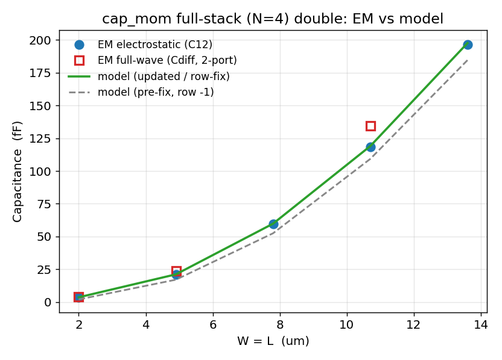
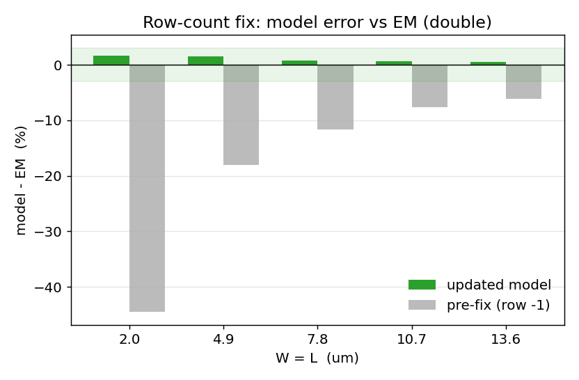
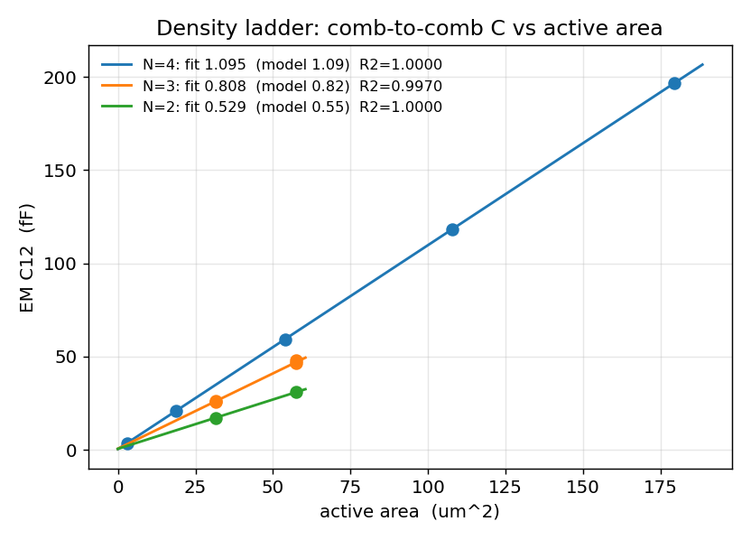
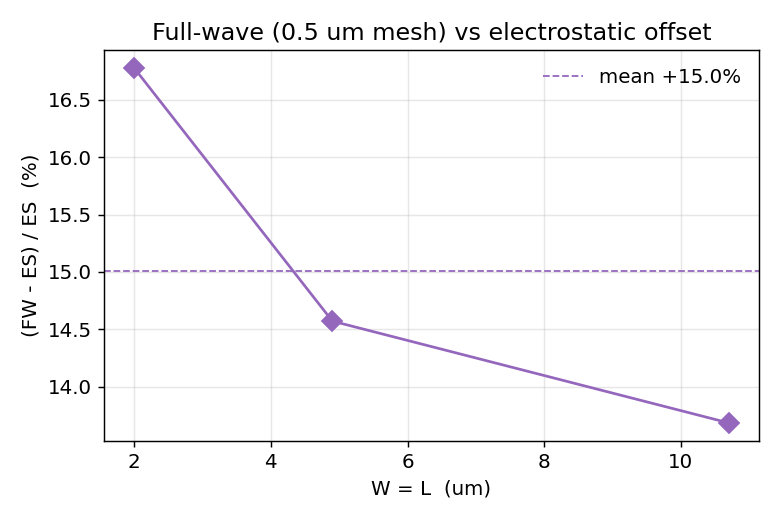

# cap_mom EM campaign, Phase 3: model validation

Palace EM (electrostatic + reference-matched 2-port full-wave) against the updated cap_cmomi Verilog-A model (worktree `cap-cmomi-rowfix`, branch `fix/cap-cmomi-row-count`, commit `356ff2d`). All layouts regenerated from that branch PCell (via fix + `floor(w/0.89)` rows), geometry XOR-verified against the simulated GDS. Model function imported from `campaign/analyze.py`, which reproduces the branch `.va` goldens (5x5 N4: double 21.11 / same 21.26 / none 20.37 fF).

## Verdict

The updated model matches EM within **+-1.6%** across the full drawn size range for the fab-relevant full-stack double devices. The row-count fix (`ay=floor(w/0.89)`, no -1) is what closes the gap: the pre-fix billing under-predicted by 6-44%. Density[N] and both feed terms are consistent with the model; the ES<->FW gap is a full-wave mesh artifact (see below), not a model error.

## Full-stack (N=4) double: C vs size

| W=L (um) | ES C12 (fF) | FW Cdiff (fF) | model (fF) | err % | pre-fix err % |
| --- | --- | --- | --- | --- | --- |
| 2.0 | 3.54 | 4.13 | 3.59 | +1.62 | -44.5 |
| 4.9 | 20.79 | 23.82 | 21.11 | +1.55 | -18.1 |
| 7.8 | 59.37 | - | 59.82 | +0.76 | -11.6 |
| 10.7 | 118.33 | 134.52 | 119.03 | +0.59 | -7.7 |
| 13.6 | 196.67 | - | 197.67 | +0.51 | -6.1 |

## Density[N] re-extracted from the fixed-via ES sweep

| N | density fit (fF/um^2) | model | intercept (fF) | R2 | n pts |
| --- | --- | --- | --- | --- | --- |
| 4 | 1.0947 | 1.09 | +0.36 | 1.00000 | 5 |
| 3 | 0.8080 | 0.82 | +0.59 | 0.99705 | 4 |
| 2 | 0.5289 | 0.55 | +0.54 | 1.00000 | 2 |

N=3 comes from `m1m3` and `m2m4` (count, not vertical position); N=2 from `m3m4`. The small positive intercept is the fringe/feed offset the pure area law omits.

## C(same) - C(double) feed delta

| W=L (um) | EM delta (fF) | model[same-double] (fF) | pad_len (um) |
| --- | --- | --- | --- |
| 2.0 | +0.040 | +0.115 | 2.20 |
| 4.9 | +0.167 | +0.143 | 4.87 |
| 7.8 | +0.127 | +0.171 | 7.54 |
| 10.7 | +0.176 | +0.208 | 11.10 |
| 13.6 | +0.305 | +0.236 | 13.77 |

Both feeds add cap to `Cmain` (double `0.152*pad_len`, same `0.1625*pad_len+0.0916`), so the same-minus-double delta is small; EM and model agree at the ~0.1 fF ES noise floor.

## Reduced-stack ladder (m1m3 / m2m4 / m3m4)

| cell | N | W (um) | L (um) | EM C12 (fF) | model (fF) | err % |
| --- | --- | --- | --- | --- | --- | --- |
| n2_m3m4_w7_l10 | 2 | 7 | 10.0 | 30.98 | 32.67 | +5.4 |
| n2_m3m4_w7_l5p5 | 2 | 7 | 5.5 | 17.14 | 18.28 | +6.6 |
| n3_m1m3_w7_l10 | 3 | 7 | 10.0 | 46.39 | 48.21 | +3.9 |
| n3_m1m3_w7_l5p5 | 3 | 7 | 5.5 | 25.57 | 26.76 | +4.7 |
| n3_m2m4_w7_l10 | 3 | 7 | 10.0 | 47.81 | 48.21 | +0.8 |
| n3_m2m4_w7_l5p5 | 3 | 7 | 5.5 | 26.35 | 26.76 | +1.5 |

Reduced-stack cells run +1 to +7% high. Two documented model simplifications, not bugs: a single `density[N]` ignores vertical position (`m2m4` reads ~3% above `m1m3` at identical N), and the double-feed coefficient (0.152, fit on 4-metal pads) over-counts ~1 fF on 2-3 metal stacks.

## Full-wave vs electrostatic

FW `Cdiff` at the campaign mesh (`refined_cellsize = 0.5 um`) sits **+14 to +17%** above ES `C12` (+16.8%, +14.6%, +13.7% at 2.0, 4.9, 10.7 um). This is a full-wave **mesh** artifact, not a physical correction. 0.5 um is coarser than the 0.84 um tooth pitch, so the solve under-resolves the inter-tooth gap that sets the capacitance; refining only that knob (same geometry) drives `Cdiff` monotonically back toward ES:

| refined_cellsize (um) | Cdiff (fF) | vs ES 20.79 |
| --- | --- | --- |
| 0.50 | 23.82 | +14.6% |
| 0.35 | 22.35 | +7.5% |
| 0.25 | 22.15 | +6.5% |
| 0.20 | 21.68 | +4.3% |
| 0.18 | 21.63 | +4.0% |

By 0.18 um it flattens near +4% (a small full-wave fringe residual, well inside model tolerance). Two earlier explanations are refuted. The dielectric: a layered 11.9/6.6 stackup vs uniform eps=4.1 moves C only -0.6%, since the comb sits buried in the 4.1 IMD and substrate/passivation load common-mode to ground and cancel in the differential (at 60 MHz the substrate is a conductor, not eps=11.9). The un-de-embedded fixture: an FW open dummy with the comb removed leaves only 0.05 fF of A-B coupling. So the campaign `Cdiff` @0.5 is an under-resolved cross-check, not a +14% correction and not the silicon twin; device-level accuracy is set by the fine-mesh ES (lc = 0.10 um) vs model, +-1.6%. Full convergence data and ruled-out hypotheses in `FW_MESH_INVESTIGATION.md`.

## Notes

- FW solves for 07p8 and 13p6 um failed on a Palace/MFEM SuperLU singular matrix during the ROM build (numerical, not RAM; 10p7 in between succeeded). FW is the cross-check; the three good points already fix the offset. Recovering them is optional.

- Large reduced-stack fab devices (65-80 um) exceed the fine-mesh RAM floor and are model-projected (Phase 4); density is intensive and set by the small cells here.

